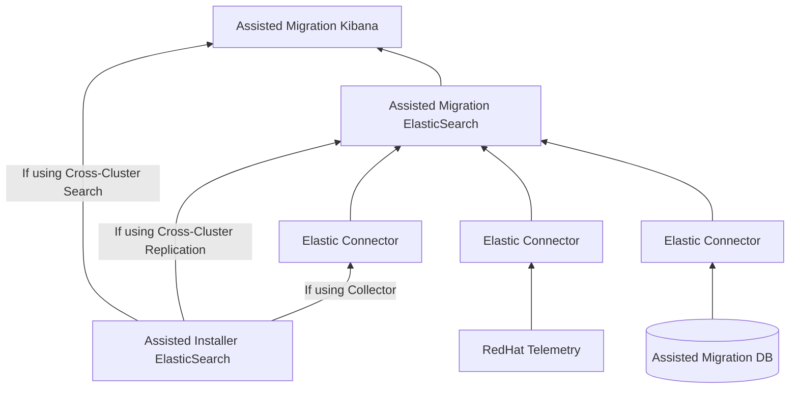
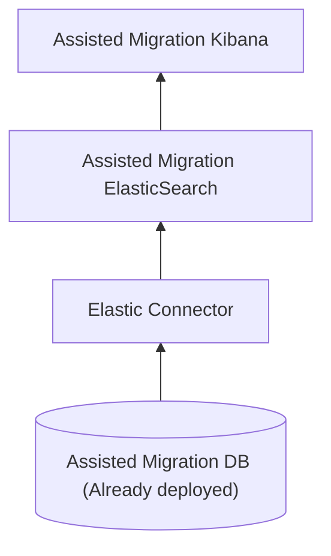

# Service Dashboard Planning

## The Problem
The process of the `Assisted Migration` tool is comprised of the following:
* Mapping the customer’s VMWare setup and generating recommendations for the creation of the target cluster
* Installing and configuring a new cluster using Assisted Installer based on the recommendations
* Migration of the Vms running on VMWare onto Openshift Virtualization

Each step of the process is executed by a different service and as a result produces different metrics stored  in different services.

The Assisted Migration Dashboard aims to consolidate all these metrics into a single dashboard platform. The dashboard should show anonymised and aggregated data; such that cannot be traced back to the specific customer.

## Data Sources

### Resource Mapping Phase

The Assisted Migration agent sends data, stript from any customer personal, back to the service which in term stores the data in a PostgreSQL database.
The schema for the data may be found in the [repository](https://github.com/kubev2v/migration-planner/blob/00981c352583a9171b594e3c71eef8131a54bbb2/api/v1alpha1/types.gen.go#L54).

As this is a new data source, there is no existing observability tool running on top of this data. Depending on the chosen dashboard stack (Grafana, ELK, etc) an corresponding agent reading the DB will be required.

### Assisted Installer

The Assisted Installer service already collects and presents data on its own monitoring stack. In the process, the service sends messages to Kafka which are processed by an event processor to form meaningful metric data which is stored in ElasticSearch. Kibana is then used for presentation.

The Assisted Migration Dashboard should mimic the dashboards presented on the Assisted Installer ones while applying a filter to present only the data coming from clusters created in the Assisted Migration process. Additional work is needed with the Assisted Installer team to understand how clusters may be marked for the use of this filter.

Assuming this filter is achievable, there are two ways to implement the dashboards - on the Assisted Installer Kibana instance or by forwarding the data from the Assisted Installer ElasticSearch into the Assisted Migration one.
For the short term, the first method may suffice. However, this means that in order to view the dashboards, users will need to switch between services. So, the long term solution should be by tapping into the Assisted Installer ElasticSearch.

### Migration

Currently, the migration data is saved only inside the cluster. Once This [PR](https://github.com/openshift/cluster-monitoring-operator/pull/2461) is merged, the metrics will be forwarded into the RedHat Telemetry service. Once the data is there, it can be forwarded to the Assisted Migration dashboard stack.
Having said that, the same issue of marking the relevant clusters exists also here. We need to understand if the same mechanism that will be applied for the Assisted Installer data can be applied here as well.

## Proposed Solution

### Dashboard Stack

Starting a project from scratch allows us to choose the dashboard stack that fits our needs. The obvious candidates are Grafana and ELK. I think that since in one of the cases, ELK was chosen while in the others fresh data is used, the Assisted Migration dashboard should also chose ELK.

### Design

## Development

### Milestone 1

For milestone 1 we will focus on presenting the Assisted Migration agent data. Also, the entire stack will run inside the same local OpenShift cluster as the rest of the solution.

This means that the following will be deployed on the cluster:

#### Tasks

* Deploy `ElasticSearch` and `Kibana` on the selected cluster. Need to understand whether the `OpenShift Elasticsearch Operator` may be used following the 4.16 deprecation notice.
* Deploy the `Elastic PostgreSQL connector` based on the [reference](https://www.elastic.co/guide/en/enterprise-search/current/connectors-postgresql.html) and [tutorial](https://www.elastic.co/guide/en/enterprise-search/current/postgresql-connector-client-tutorial.html)
* Present the data in a `Kibana` Dashboard

### Milestone 2

The exact content of Milestone 2 is still TBD. The following are possible tasks:

* Deploy `ElasticSearch` and `Kibana` outside of the cluster
* Connect to `RedHat Telemetry`
* Connect to `Assisted Installer ElasticSearch`